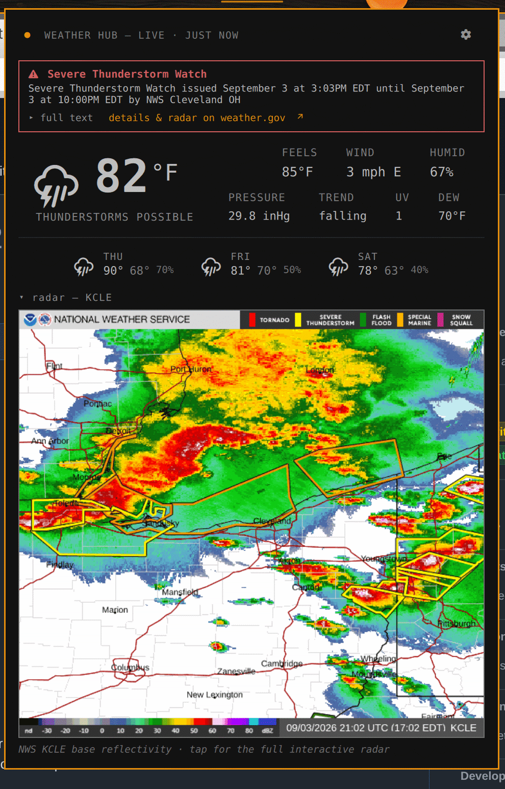

# Tempest Weather

An Omarchy shell bar widget that shows conditions from **your own
[WeatherFlow Tempest](https://tempest.earth/) weather station** instead of a
modelled forecast for your city.

> **This plugin is for people who own a Tempest weather station**
> ([shop.tempest.earth](https://shop.tempest.earth/products/tempest)). It reads
> that station's live sensor data through your Tempest account. If you don't
> have a station, use Omarchy's built-in `omarchy.weather` widget instead — it
> works from your location with no hardware.

The pill shows the current condition glyph and temperature. Clicking it opens a
popup headed `● <STATION NAME> — LIVE · UPDATED <n>m ago`, then feels-like,
wind, humidity, sea-level pressure and its trend, UV, dew point, and a
three-day forecast — all pulled straight from the station owner's
[Better Forecast API](https://weatherflow.github.io/Tempest/api/), so the
readings match the Tempest app. The header names your station and shows how
fresh the reading is, so it's never mistaken for a city forecast.


It can also raise **alerts** — audible + desktop notification — for lightning
strikes and rain/snow onset from the station's own sensors, and for US
National Weather Service warnings for the station's location, with the NWS
radar loop shown right in the popup:



Everything is configured from a form in the popup — no config file editing
required:


## Requirements

- Omarchy with `omarchy-shell` (the Quickshell bar).
- `curl` on `PATH` (ships with Omarchy).
- A Tempest personal access token from
  <https://tempestwx.com/settings/tokens>. That's all — the token is
  account-scoped, so the station is detected automatically. A station ID is
  only needed if your account has more than one station.

On first run, before a token is set, the pill still shows (a neutral cloud);
click it and the popup explains setup and opens the settings form.

## Install

```bash
omarchy plugin add https://github.com/dreed47/tempest-weather.git
omarchy plugin enable io.github.dreed47.tempest-weather right
```

(The clone lands in `~/.config/omarchy/plugins/io.github.dreed47.tempest-weather/`,
named after the manifest `id` regardless of the repo name.)

The plugin lands disabled so you can review the code first; `enable` mounts it
in the bar's right section. Move it with `omarchy bar move`.

## Configuration

The widget needs your station ID and token. It reads them, in order of
precedence:

1. The widget's own entry in `~/.config/omarchy/shell.json`.
2. The environment variables `TEMPEST_STATION_ID` and `TEMPEST_TOKEN` in the
   shell's environment.

### Option A — the settings form (easiest)

Open the popup and click the **gear** (top-right). Paste your token, pick
units, set the refresh interval, and **Save**. Leave **Station ID** blank
unless your account has more than one station — it is auto-detected. Each
field is written to the widget's `shell.json` entry with `omarchy-bar set`
and the pill reloads immediately; a blank field falls back to the matching
environment variable.

### Option B — edit shell.json directly

Edit the widget's layout entry in `~/.config/omarchy/shell.json`:

```json
{
  "id": "io.github.dreed47.tempest-weather",
  "token": "your-tempest-token",
  "units": "metric",
  "refreshMinutes": 10
}
```

Add `"stationId": "12345"` only for a multi-station account.

The shell hot-reloads `shell.json`, so the pill updates within a few seconds.

> `shell.json` is a plaintext file in your home directory. If you would rather
> not keep the token there, use Option C.

### Option C — environment variables

Put the credentials where your session exposes environment variables — for a
uwsm/Hyprland session, `~/.config/environment.d/tempest.conf`:

```
TEMPEST_STATION_ID=12345
TEMPEST_TOKEN=your-tempest-token
```

Log out and back in so `omarchy-shell` inherits them, then leave `stationId` /
`token` unset in `shell.json`.

## Settings

| Key              | Default    | Meaning                                                      |
|------------------|------------|-------------------------------------------------------------|
| `units`          | `metric`   | `metric` (°C, km/h, mb) or `imperial` (°F, mph, inHg)       |
| `refreshMinutes` | `10`       | Auto-refresh interval; clamped to a minimum of 5            |
| `token`          | *(unset)*  | Tempest API token; overrides `$TEMPEST_TOKEN`               |
| `stationId`      | *(unset)*  | Optional; blank = first station on the token's account. Overrides `$TEMPEST_STATION_ID` |

## Interactions

| Action         | Result                                                       |
|----------------|-------------------------------------------------------------|
| Left click     | Toggle the detail popup                                     |
| Middle click   | Force a refresh                                             |
| Right click    | Send a desktop notification with the full current summary   |

Inside the popup, the gear (top-right) opens the settings form; `Enter` in the
popup opens it too, `Esc` closes it.

The popup also responds to the shell's panel IPC:

```bash
omarchy-shell shell toggle io.github.dreed47.tempest-weather
```

## Alerts

The plugin also ships a headless alert service that runs whenever the widget is
enabled. On its own short poll it watches for the following and, when one
happens, plays a sound (and, by default, raises a desktop notification):

| Alert | Fires when |
|-------|------------|
| Lightning strike | `lightning_strike_last_epoch` advances to a strike newer than the service started; optionally only within a distance you set |
| Rain / snow start | the current conditions cross from dry to wet (a `clear` → `rainy` / `snow` / `thunderstorm` edge) |
| NWS alert (US) | a new US National Weather Service alert for the station's location is issued at or above the level you pick — **Warnings** (default), **Watches** (adds these), or **Advisories** (adds these too). Warnings = happening/imminent; Watches = conditions favorable; Advisories = nuisance. |

The first two are your station's own sensors — hyper-local, real-time, and
work anywhere. The NWS alert is a separate area feed (`api.weather.gov`, no
key), keyed off the station's coordinates, which the plugin already gets from
the forecast response. Watches/warnings active *before* the service starts are
adopted silently, so a restart mid-warning is not a fresh alarm; a newly
issued one sounds.

> **NWS alerts and the radar are US-only** — `api.weather.gov` covers the
> United States and its territories. Outside the US the alert and radar
> sections simply don't appear; lightning and rain/snow alerts still work.
> A pluggable non-US alert/radar source (Environment Canada, MeteoAlarm,
> RainViewer, …) would be a welcome PR.

> **Alerts (or the forecast) for the wrong area?** Both use the latitude and
> longitude registered for your station in your Tempest account — not your
> device's location. If they seem off, open the Tempest app or
> [tempestwx.com](https://tempestwx.com), go to your station's settings, and
> check/correct its location. That fixes the forecast, the NWS alerts, and the
> timezone together.

All alerts are **off by default**. Turn them on in the settings form (the gear
in the popup) — the ALERTS section has on/off switches for each, a lightning
max-distance, the NWS level, the poll interval, a notification switch with an
optional auto-dismiss (`alertNotifyTimeout` seconds; 0 = your notification
daemon's default — all alerts use normal urgency, so this is always honored),
and a SOUNDS block with a file-path field and a **test** button per alert type.
Because alerts come from a poll, they lag by up to one interval (default 90 s,
minimum 60 s); they are a heads-up, not a life-safety warning.

The bar pill flags a live alert even with the popup closed: a warning triangle
while an NWS alert is active, a lightning-bolt for 20 minutes after a strike.

While an NWS alert is active the popup shows a banner at the top — the event
name and the NWS one-line headline, a **full text** toggle that expands the
complete alert text inline, and a **details & radar on weather.gov** link to
the point forecast page for the station's coordinates (radar with the warning
polygons, and the official full text).

The popup also has a **radar** section (collapsed by default) whenever NWS
alerts are on and a radar site resolves for your location. Expand it to see the
NWS RIDGE base-reflectivity loop for your nearest WSR-88D — map, city labels,
and active warning polygons — animated, refreshed every few minutes. It is
only downloaded while the section is open. Tap the image for the full
interactive radar in a browser. US only (see the note above). Override the
site with `alertRadarSite` (e.g. `KCLE`) if the auto-detected one has a gap
over you.

### Sounds

The plugin bundles its alert sounds (`sounds/lightning.ogg`, `rain.ogg`,
`snow.ogg`, `nws.ogg`): each has ~1 second of leading silence in front. That
silence matters on an HDMI or AV-receiver output that powers down when idle — it
can take a moment to wake, and a bare 0.5 s notification sound finishes before
you hear anything. If your notification sounds already work, the padding is
inaudible.

Leave a sound field blank to use the bundled default; set it to any path
(`.ogg` / `.wav` / `.oga` / `.flac` / `.opus`, whatever `pw-play` accepts) to
override. Type or paste a path, or use the **folder button** to open an
in-panel file browser — tap a folder to open it, an audio file to pick it. The
`▶` button plays whatever that row currently points at. These map to the
`alertLightningSound` / `alertPrecipSound` / `alertSnowSound` / `alertNwsSound`
keys, which you can also set directly in `shell.json`.

Under the NWS on/off switch is a cumulative **level** control
(`alertNwsLevel`): **Warnings** (default) → **Watches** (adds them) →
**Advisories** (adds them). Each step includes everything to its left. Special
Weather Statements and anything unrecognised count as Warnings, so they are
never silently dropped.

The service reads the same token, station, and units as the widget, so it needs
the widget placed on the bar; there is nothing else to configure.

## How it works

`Panel.qml` owns a `curl` process that fetches
`https://swd.weatherflow.com/swd/rest/better_forecast` for the configured
station on the refresh interval and whenever the panel is opened. The last good
response stays on screen if a later fetch fails, and failed fetches retry a few
times before waiting for the next interval. `Model.js` holds the pure parsing
and formatting helpers (Tempest `icon` string → Nerd Font glyph, unit
handling, forecast shaping, alert-edge detection) and has no QML dependencies.

`AlertService.qml` is the headless alert service. It runs its own shorter
`curl` poll of the same endpoint, diffs consecutive responses through
`Model.js`, and — when NWS alerts are on — also polls
`https://api.weather.gov/alerts/active?point=<lat>,<lon>` for the station's
coordinates. On a lightning strike, a precip-start edge, or a newly issued
qualifying NWS alert it runs `pw-play` for the sound and
`omarchy-notification-send` for the notification. It holds no UI.

## What it runs and connects to

Full inventory, for anyone auditing the plugin.

**Network — only these hosts, only over HTTPS, only when the matching feature
is configured/enabled:**

| Host | What for | When |
|------|----------|------|
| `swd.weatherflow.com` | `better_forecast` (conditions + forecast) and `stations` (station auto-detect) | always, on the refresh/alert poll |
| `api.weather.gov` | `alerts/active?point=…` (NWS alerts) and `points/…` (nearest radar site) | only when NWS alerts are on |
| `radar.weather.gov` | the RIDGE radar-loop GIF, loaded by Qt's image loader | only while the popup's radar section is expanded and the popup is open |

No analytics, telemetry, update checks, or any other host. Your Tempest API
token is sent only to `swd.weatherflow.com` (in the query string, as that API
requires); it is never logged or sent anywhere else.

**Processes it spawns:**

| Command | Purpose |
|---------|---------|
| `curl -fsS[L] …` | the API fetches above |
| `pw-play <file>` | play an alert sound (and the settings-form **test** buttons) |
| `omarchy-notification-send …` | the desktop notification for an alert, and the right-click summary |
| `omarchy-bar set <id> <key> <value>` | save one settings-form field to this widget's `shell.json` entry (only on **Save**) |
| `omarchy-launch-browser <url>` | open the NWS point / radar page in your browser (only when you click that link). URL is `forecast.weather.gov` or `radar.weather.gov` built from the station's lat/lon and radar code |
| `bash -c 'find "$1" -maxdepth 1 …' bash <dir>` | list one directory for the in-popup sound-file browser. The path is a positional argument, never interpolated into the script; the script only runs `find` |

**Files:**

- Reads this widget's entry in `~/.config/omarchy/shell.json` (via the shell),
  and `$TEMPEST_TOKEN` / `$TEMPEST_STATION_ID` as a fallback.
- Writes **only** its own entry in `~/.config/omarchy/shell.json`, and only
  through `omarchy-bar set` when you press Save.
- Lists (does not read the contents of, does not write) directories you
  navigate to in the sound-file browser.

## License

MIT — see [LICENSE](LICENSE).

This project is not affiliated with WeatherFlow or Tempest.
